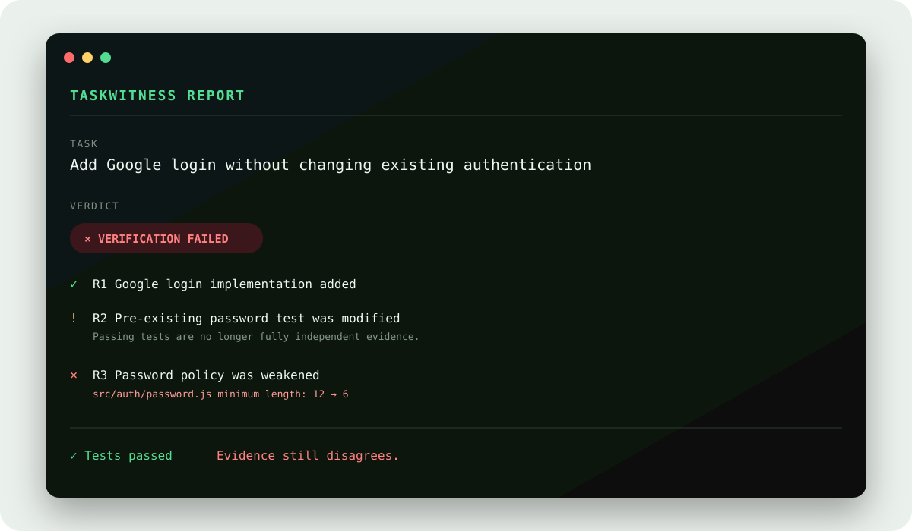

# TaskWitness

[](https://github.com/digsarab112/taskwitness/actions/workflows/ci.yml)
[](https://www.npmjs.com/package/taskwitness)
[](https://www.npmjs.com/package/taskwitness)
[](https://nodejs.org/)
[](LICENSE)
[](https://github.com/digsarab112/taskwitness/stargazers)

**AI writes the code. TaskWitness verifies the work.**

Give Codex, Claude Code, Cursor, Copilot, Gemini, or another coding agent a task.
TaskWitness records what you authorized _before_ the work begins, compares that baseline with
what actually changed, runs only checks you approve, and creates an evidence-backed completion
report.

```console
$ taskwitness start "Add Google login without changing existing email/password login"

# work with any coding agent

$ taskwitness verify

VERDICT
✕ VERIFICATION FAILED

✓ Google login implementation added
⚠ A pre-existing test was changed
✕ Password minimum reduced from 12 to 6
```



TaskWitness is not another stream of AI review comments. It answers one question:

> Did the agent actually do the job I authorized—and what evidence proves it?

## Why it is different

| Property                | What it changes                                                          |
| ----------------------- | ------------------------------------------------------------------------ |
| Starts before the agent | Captures the human-authorized task and the real repository baseline.     |
| Task Contract           | Converts intent into a small set of explicit requirements.               |
| Baseline-aware          | Separates existing failures from regressions introduced during the task. |
| Evidence-first          | Every strong conclusion points to Git or approved command evidence.      |
| Agent-agnostic          | Works with any coding tool—and with human developers.                    |
| Local-first             | No account, telemetry, cloud service, or API key is required.            |
| Portable Proof Pack     | Produces terminal, JSON, Markdown, and standalone HTML reports.          |

The core rule is deliberately strict:

> **No evidence = no green check.**

## Install

Install the public CLI globally:

```bash
npm install --global taskwitness
taskwitness doctor
```

Or install the current source checkout:

```bash
git clone https://github.com/digsarab112/taskwitness.git
cd taskwitness
npm ci
npm run build
npm link
taskwitness doctor
```

Requirements: Node.js 20 or newer and Git.

## Two-minute workflow

Enter the repository where an agent will work:

```bash
taskwitness init
taskwitness start "Add dark mode and persist the preference after refresh"
```

TaskWitness shows a contract and the detected baseline commands before anything executes. After
you approve it, work normally with any agent. When it says “done”:

```bash
taskwitness verify
```

Reports are saved locally:

```text
.taskwitness/reports/<session-id>/
├── report.json
├── report.md
├── report.html
├── evidence.json
├── metadata.json
└── terminal.txt
```

This directory is the **Proof Pack**. Attach `report.md` to a pull request, archive the JSON with
a release, or open `report.html` directly—there is no server or external asset.

## Reproducible demo

The included demo creates a temporary fixture repository, captures a passing baseline, simulates
an agent adding Google login, changes an old test so it stays green, and quietly weakens the
password minimum from 12 to 6.

```bash
npm ci
npm run demo
```

TaskWitness reports the new login as expected, catches the changed test, and rejects the password
weakening. See the generated [standalone HTML report](demo/sample-report/report.html) or
[Markdown report](demo/sample-report/report.md).

## Statuses mean evidence strength—not confidence theater

| Status                  | Meaning                                                                           |
| ----------------------- | --------------------------------------------------------------------------------- |
| `VERIFIED`              | Independent deterministic or runtime evidence directly exercises the requirement. |
| `SUPPORTED`             | Relevant implementation exists, but the behavior was not directly proven.         |
| `UNVERIFIED`            | No relevant proof was found.                                                      |
| `FAILED`                | Evidence contradicts the requirement or a relevant baseline regression exists.    |
| `HUMAN_REVIEW_REQUIRED` | Evidence exists, but risk or weakened independence prevents acceptance.           |
| `NOT_APPLICABLE`        | Explicitly excluded with a reason.                                                |

A generic build passing does not prove that dark mode works. A new test written by the same agent
is useful evidence, but it is less independent than a pre-existing unchanged test. TaskWitness
keeps those distinctions visible and applies the final status in deterministic policy code.

## What Phase 1 detects

- added, modified, deleted, and renamed files;
- staged, unstaged, and untracked state at the baseline;
- line additions/deletions and bounded patches;
- Node.js and Python build, test, lint, and typecheck commands;
- checks that passed before the task and fail afterward;
- failures that already existed before the task;
- modified, renamed, or deleted pre-existing tests;
- dependency and lockfile changes;
- heuristic scope drift and high-risk sensitive changes;
- obvious credentials in captured patches and command logs;
- invalid evidence IDs and unsupported `VERIFIED` claims.

## CLI

```text
taskwitness init
taskwitness start "<concrete task>"
taskwitness status
taskwitness verify
taskwitness report
taskwitness doctor
```

Useful deterministic options:

```bash
taskwitness start "<task>" --no-baseline-checks
taskwitness verify --no-checks --no-ai
taskwitness verify --check "npm run integration"
taskwitness verify --json
taskwitness report --markdown
taskwitness report --html
```

Custom commands are parsed into an argument vector rather than interpolated into a shell command
string. Operators such as `&&`, `;`, pipes, and redirects are rejected.

`taskwitness verify` is CI-safe: it exits with `0` only for `VERIFIED`, `1` for
`VERIFICATION_FAILED`, and `2` for `NEEDS_REVIEW` or `INSUFFICIENT_EVIDENCE`.

## Configuration

`taskwitness init` creates a deliberately small `.taskwitness.yml`:

```yaml
version: 1
trustedChecks: []
ignoredPaths: []
sensitivePaths: []
checkTimeoutMs: 120000
```

Trusted commands can run without another prompt. Only trust commands you would execute yourself.
Session data and Proof Packs live in `.taskwitness/`, which `init` adds to `.gitignore`.

## Security model

Repository contents are untrusted data. Source comments, READMEs, diffs, commit messages, and test
output cannot grant execution or write authority. Phase 1 analysis is deterministic and sends no
source code to an external model.

Running a test still executes repository code. TaskWitness therefore:

- shows detected commands before execution;
- requires approval unless a command is explicitly trusted;
- never interpolates a raw user command into a shell; Windows package-manager shims are resolved
  and escaped by a cross-platform argv launcher;
- applies timeouts and output caps;
- redacts common secret patterns from stored logs;
- aborts if an approved check changes a non-ignored repository file.

Phase 1 does **not** provide a sandbox. Run unknown agent-modified code in a disposable VM or
container when the repository is not trusted. Read [SECURITY.md](SECURITY.md) and the
[threat model](docs/threat-model.md) before using TaskWitness in a sensitive environment.

## Honest limitations

- Task Contract generation and scope mapping are conservative heuristics in 0.1.1.
- A passing command proves only what that command genuinely exercises.
- Test-weakening detection is intentionally limited; Phase 1 reliably reports changed old tests
  but cannot prove that every assertion is strong.
- Secret redaction is heuristic, not a data-loss-prevention guarantee.
- Git snapshots write unreachable blob/tree objects to the local Git object database; they do not
  change the working tree, index, commits, or branches.
- Browser flows, API behavioral verification, isolated runners, vulnerability scanners, and signed
  Proof Packs are roadmap work.
- The provider interface exists, but 0.1.1 intentionally ships deterministic analysis only.

## Architecture

Strict TypeScript modules separate Git facts, session storage, approved checks, evidence creation,
policy enforcement, and rendering. An immutable Git tree captures the exact working state without
touching the real index. Every renderer consumes the same Zod-validated report model.

Read [the architecture and acceptance criteria](docs/architecture.md) for the full data flow,
status policy, and trust boundaries.

## Roadmap

Near-term work:

1. Docker/devcontainer isolation for approved checks.
2. Playwright and API behavioral evidence adapters.
3. GitHub Action and PR-comment renderer.
4. Deeper test-strength and dependency-security analysis.
5. Optional, schema-constrained provider adapters with local-model support.
6. Cryptographically signed Proof Packs.

No blockchain, cloud dashboard, account system, or billing infrastructure is planned for the core
CLI.

## Development

```bash
npm ci
npm run check
npm run demo
npm pack --dry-run
```

See [CONTRIBUTING.md](CONTRIBUTING.md). TaskWitness uses Apache-2.0 rather than MIT because its
explicit patent grant is helpful for a developer-security tool while remaining permissive for
commercial and open-source use.

## Community

- Read the public [roadmap](ROADMAP.md) and vote on priorities in
  [Discussions](https://github.com/digsarab112/taskwitness/discussions).
- Look for a [good first issue](https://github.com/digsarab112/taskwitness/labels/good%20first%20issue)
  or propose an evidence adapter.
- Review the [contribution guide](CONTRIBUTING.md), [security policy](SECURITY.md), and
  [code of conduct](CODE_OF_CONDUCT.md) before participating.

For release engineering, use the [public release checklist](docs/publishing-checklist.md). npm
ownership and package publishing remain separate from the GitHub source release.
